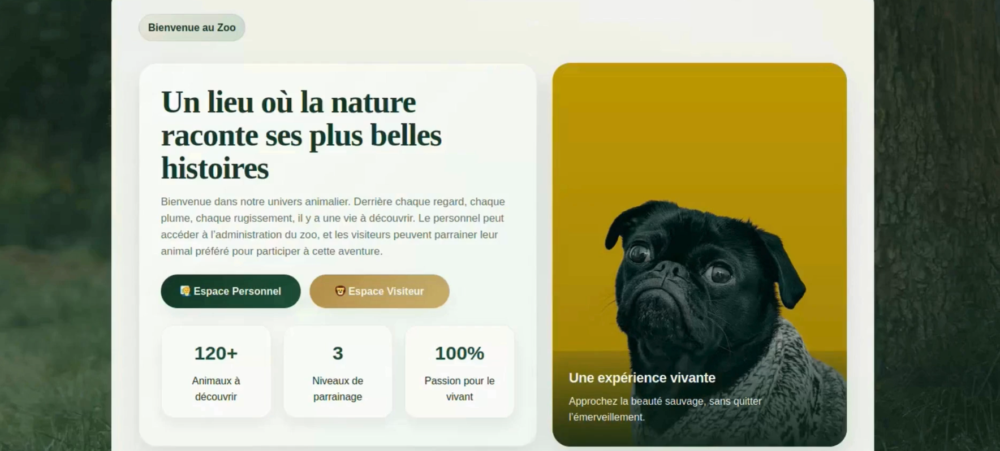
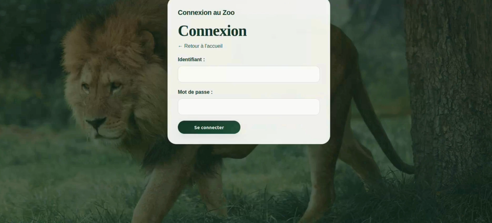
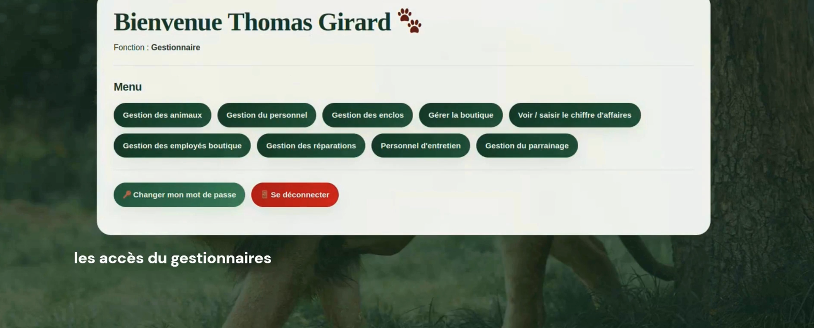
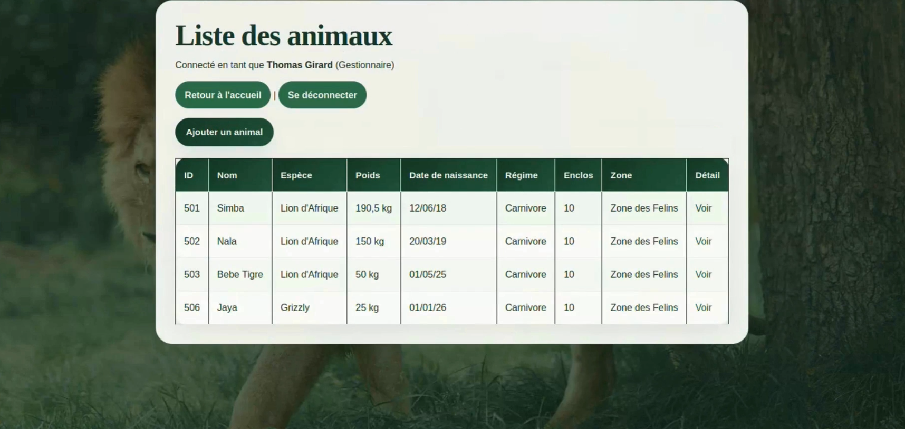
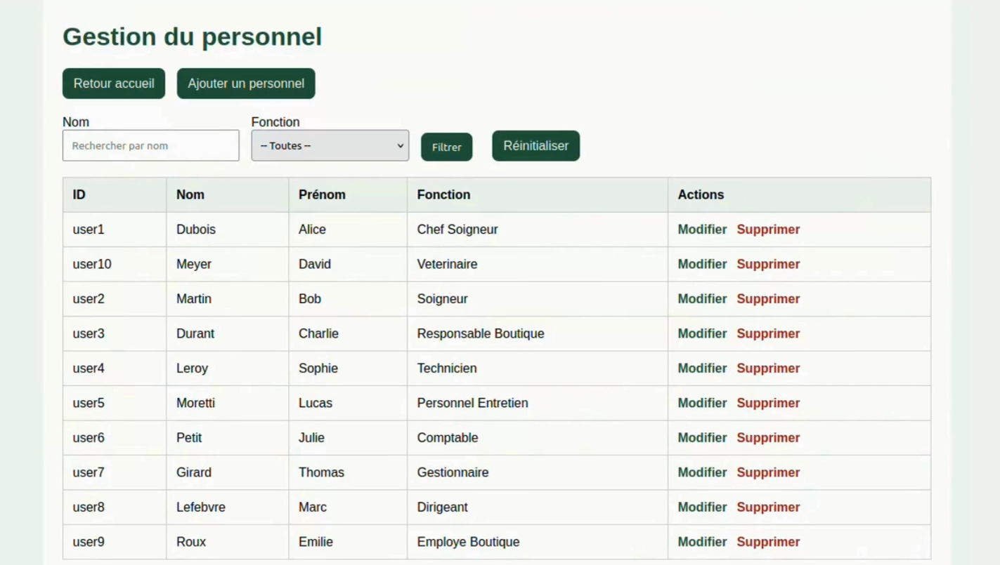

# 🦁 ZooManager — Application web de gestion d'un zoo

> Développé par **Nada Cherine Chetloul** 

---

## 📸 Aperçu

<video src="https://github.com/user-attachments/assets/9dd81e6b-88db-46a3-a901-6482a78f43c6" controls width="100%"></video>

<!-- SCREENSHOT 1 : Page d'accueil  -->

<!-- SCREENSHOT 2 : Page connexion (avec les menus visibles) -->

<!-- SCREENSHOT 3 : Page d'accueil après connexion (avec les menus visibles) -->

<!-- SCREENSHOT 4 : Liste des animaux -->

<!-- SCREENSHOT 5 : Interface d'un rôle (ex. soigneur ou gestionnaire) -->


---

## 🌐 Description

ZooManager est une application web de gestion interne d'un zoo.  
Elle permet à chaque membre du personnel d'accéder uniquement aux fonctionnalités liées à son poste, grâce à un système de rôles et de permissions géré en PHP.

L'application distingue deux espaces :
- **Espace personnel** — réservé aux employés du zoo (accès par identifiant et mot de passe)
- **Espace visiteur** — permet aux visiteurs d'enregistrer un parrainage d'animal

---

## 🛠️ Stack technique

| Élément | Technologie |
|---|---|
| Back-end | PHP (sessions, OCI, bcrypt) |
| Base de données | Oracle |
| Front-end | HTML / CSS |
| Sécurité | `password_hash()` / `password_verify()`, requêtes paramétrées |

---

## 🚀 Lancer le projet

1. Cloner le dépôt
2. Configurer la connexion Oracle dans le fichier de configuration
3. Ouvrir dans le navigateur :

```
http://10.1.16.112/~votre_login/index.php
```

---

## 🔐 Comptes de test

Tous les comptes utilisent le mot de passe par défaut : `monmotdepasse`  
Il peut être changé à tout moment depuis l'interface (via `changer_mot_de_passe.php`).

| Identifiant | Rôle | Niveau d'accès |
|---|---|---|
| `user8` | Dirigeant | Maximum — accès complet |
| `user7` | Gestionnaire | Élevé — gestion opérationnelle |
| `user1` | Chef soigneur | Moyen-haut — soins & nourrissage |
| `user10` | Vétérinaire | Moyen — suivi des soins |
| `user2` | Soigneur | Moyen — soins & nourrissage |
| `user4` | Technicien | Limité — réparations & enclos |
| `user3` | Responsable boutique | Boutique — gestion boutique & CA |
| `user6` | Comptable | Consultatif — CA uniquement |
| `user9` | Employé boutique | Minimal — consultation boutique |
| `user5` | Personnel d'entretien | Très limité — enclos uniquement |

---

## 🗄️ Structure de la base de données

<details>
<summary>Voir les tables principales</summary>

| Table | Description |
|---|---|
| `personnel` | Tous les employés (login, mot de passe hashé, fonction, zone) |
| `animal` | Animaux (espèce, enclos, poids, régime alimentaire, filiation) |
| `soigner` | Interventions de soin (animal, personnel, type de soin, date) |
| `nourrir` | Nourrissages (animal, personnel, nourriture, date) |
| `boutique` | Boutiques du zoo |
| `employe_boutique` | Lien employés / boutiques |
| `reparation` | Réparations (nature Petit/Gros, libellé) |
| `faite` | Lien réparation ↔ enclos |
| `personnel_technique` | Lien technicien ↔ réparation Petit |
| `realise` | Lien prestataire ↔ réparation Gros |
| `parrainage` | Parrainages d'animaux (niveau, prestation) |
| `parraine` | Parrains (nom, prénom) |
| `ca_journalier` | Chiffre d'affaires journalier par boutique |

</details>

---

## 👥 Rôles et permissions

Chaque page PHP vérifie `$_SESSION['fonction']` en haut de fichier et redirige si l'accès n'est pas autorisé. Voici ce que chaque rôle peut faire :

<details>
<summary>🔴 Dirigeant — accès maximal</summary>

Accède à tous les menus : animaux, personnel, enclos, boutique, CA, réparations, parrainage.  
Peut modifier et supprimer des membres du personnel, consulter les parrainages avec filtres.

</details>

<details>
<summary>🟠 Gestionnaire — gestion opérationnelle</summary>

Seul rôle pouvant **ajouter**, **modifier** ou **supprimer** du personnel.  
Peut ajouter/modifier des boutiques, affecter un responsable de boutique, ajouter des animaux.

</details>

<details>
<summary>🟡 Chef soigneur & Soigneur — soins et nourrissage</summary>

Peuvent enregistrer des soins simples (vaccination, brossage, nettoyage) et des nourrissages.  
Si un type de nourriture n'existe pas encore en base, il est créé automatiquement.  
Aucun accès à la gestion du personnel ou à la boutique.

</details>

<details>
<summary>🟢 Vétérinaire — suivi des soins uniquement</summary>

Accède uniquement au suivi des soins **complexes** (examen, chirurgie, radiographie).  
Tout le reste est bloqué.

</details>

<details>
<summary>🔵 Technicien — réparations Petit uniquement</summary>

Peut ajouter des réparations de type **Petit** uniquement.  
Double protection : l'option "Gros" est absente du HTML **et** refusée côté serveur PHP.  
Son identifiant est pré-rempli automatiquement dans le formulaire.

</details>

<details>
<summary>🟣 Responsable boutique — gestion de sa boutique</summary>

Gère les employés de sa boutique et consulte le CA.  
Ne peut pas affecter de responsable (réservé au Gestionnaire).

</details>

<details>
<summary>⚪ Comptable, Employé boutique, Personnel d'entretien</summary>

Accès en **lecture seule** sur leur périmètre respectif (CA, boutique, enclos).  
Aucune action de saisie ou de gestion.

</details>

---

## ⚙️ Points techniques notables

### Authentification (`login2.php`)
1. Recherche de l'identifiant avec `TRIM()` pour éviter les espaces parasites Oracle
2. Vérification du mot de passe via `password_verify()` contre le hash bcrypt en base
3. Stockage en session : `id_personnel`, `nom`, `prenom`, `fonction`
4. Toutes les pages protégées vérifient `isset($_SESSION['id_personnel'])` et redirigent sinon
5. La déconnexion (`logout.php`) appelle `session_unset()` + `session_destroy()`

### Requêtes Oracle paramétrées
Toutes les requêtes utilisent `oci_bind_by_name()`.  
Les filtres optionnels suivent ce pattern :
```sql
WHERE (:param IS NULL OR LOWER(champ) LIKE LOWER('%' || :param || '%'))
```
La chaîne vide est convertie en `null` PHP avant le bind pour ignorer le filtre automatiquement.

### Transactions et rollback (`ajout_reparation.php`)
L'ajout d'une réparation touche plusieurs tables (`reparation`, `faite`, puis `personnel_technique` ou `realise`).  
Le code utilise `OCI_NO_AUTO_COMMIT` sur chaque insertion intermédiaire et n'appelle `oci_commit()` que si tout réussit — sinon `oci_rollback()`.

### Création automatique de nourriture (`ajout_nourrissage.php`)
Si le type de nourriture saisi n'existe pas encore :
1. Calcul d'un nouvel id via `MAX(id_nourriture) + 1`
2. Insertion avec `dose_journaliere = 0`
3. Puis insertion du nourrissage normalement

Cela évite une erreur de clé étrangère sans obliger l'utilisateur à pré-créer la nourriture.

### Double protection Technicien
Le type "Gros" est bloqué à deux niveaux :
- **HTML** : l'option n'apparaît pas dans le `<select>` (rendu conditionnel PHP)
- **PHP serveur** : vérification explicite — même si le HTML est manipulé côté client, le serveur refuse

### Gestion des encodages Oracle (`Vétérinaire`)
La condition dans `accueil.php` teste plusieurs variantes orthographiques pour gérer les problèmes d'encodage UTF-8 / Oracle :
```php
if ($fonction == "Veterinaire" || $fonction == "Vétérinaire")
```

### Anti-doublon responsable boutique (`affecter_responsable_boutique.php`)
Deux `SELECT` préalables vérifient :
1. Que la boutique n'a pas déjà un responsable (`est_responsable = 1`)
2. Que le personnel n'est pas déjà lié à cette boutique

---

## 📁 Structure du projet

```
zoo-manager/
├── index.php
├── login2.php
├── logout.php
├── accueil.php
├── changer_mot_de_passe.php
│
├── animaux/
│   ├── ajout_animal.php
│   └── ...
│
├── personnel/
│   ├── gestion_personnel.php
│   ├── ajouter_personnel.php
│   ├── modifier_personnel.php
│   ├── supprimer_personnel.php
│   └── personnel_entretien.php
│
├── soins/
│   ├── ajout_soin.php
│   ├── soins.php
│   └── ajout_nourrissage.php
│
├── boutique/
│   ├── boutique.php
│   ├── ajouter_boutique.php
│   ├── modifier_boutique.php
│   ├── employes_boutique.php
│   ├── affecter_responsable_boutique.php
│   └── ca.php
│
├── reparations/
│   ├── ajout_reparation.php
│   └── enclos.php
│
└── parrainage/
    └── parrainage_gestion.php
```

---

## 📷 Screenshots à ajouter

Place tes captures dans un dossier `screenshots/` à la racine du repo :

| Fichier | Ce qu'il doit montrer |
|---|---|
| `screenshots/accueil.png` | Page d'accueil après connexion avec les menus visibles |
| `screenshots/animaux.png` | Liste des animaux (table avec données réelles) |
| `screenshots/espace-personnel.png` | Vue connectée d'un rôle (ex. gestionnaire) |

---


